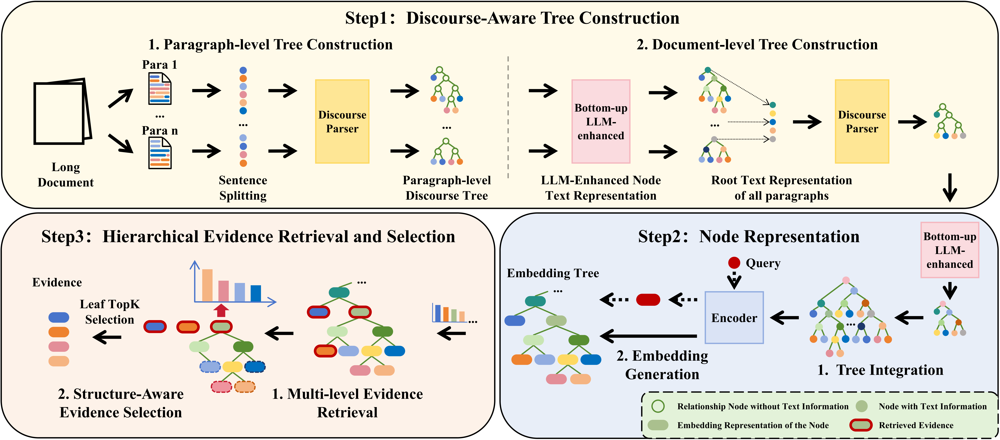

# DISRetrieval: Harnessing Discourse Structure for Long Document Retrieval

## Overview


## Environment
In order to ensure the consistency of the experimental environment, three different virtual environments need to be set up.
- RSTparser: Used for rst parsing process. Requirements are in file `requirements_RSTparser.txt`.
- vllm: Used for LLM summzrization. Requirements are in file `reqirements_vllm.txt`.
- rag: Used for node text embedding, retrieval and question answering. Requirements are in file `reqirements_rag.txt`

## Data
Preprocessed datasets are in folder `data/qasper/doc_data` and `data/quality/doc_data`. 
- `subtree.json` is the paragraph-level splited and processed data prepare for rst parsing models. 
- `subtree_sentmap.json` is the map from splited sentence to the original sentence, and is used to restore sentences after parsing.
- `question_map.json` is the questions of datasets used for RAG.

## Quick start
- Train the RST parser. For more details, see `rst_parser/README.md`.
- `cd DISRetrieval`
- Run 
    ```
    bash parsing_and_summarize_pipeline.sh
    ```
    to start parsing, summarize and rst tree build. This script performs paragraph-level parsing → LLM summarization → document-level parsing → LLM summarization → tree merging, corresponding to `"Step1: Discourse-Aware Tree Construction"` in our [framework](#framework).
- After tree building, run 
    ```
    bash embedding_and_retrieve_pipeline.sh
    ``` 
    to start node embedding and tree retrieval. This script performs the `"Setp2: Node Representation"` and `"Step3: Hierarchical Evidence Retrieval and Selection"` process in our [framework](#framework).
- Set `DATA_DIR` config in each `.sh` file to use different dataset.

## Evaluate
- Run `python evaluate/qasper_evaluate.py --predictions $result_file$` for QASPER dataset evaluation.
- Run `python evaluate/quality_evaluate.py --path $result_file$ --model unifiedQA` for QuALITY dataset. You should set `unifiedQA` for UnifiedQA model answering results and `llm` for LLM answering results.

## Project Format Reference
- The RST part settings follow [Yu's work](https://github.com/yunan4nlp/E-NNRSTParser). 
- The Sentence-Bert model can download from [multi-qa-mpnet-base-cos-v1](https://huggingface.co/sentence-transformers/multi-qa-mpnet-base-cos-v1). 
- The UnifiedQA-3B model can download from [unifiedqa-t5-3b](https://huggingface.co/allenai/unifiedqa-t5-3b)


